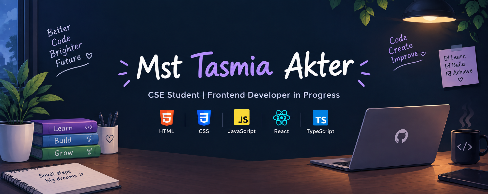

  

<h1 align="center">Hi 👋, I'm Mst Tasmia Akter</h1>

<h3 align="center">
CSE Student | Frontend Developer in Progress
</h3>

## 👩‍💻 About Me

I'm a CSE student currently exploring web development and
building my foundation in frontend technologies.

I enjoy learning by building projects, practicing problem-solving,
and exploring new technologies.

Currently, I'm focusing on JavaScript, React, TypeScript,
Git & GitHub, and cybersecurity fundamentals.

## 🚀 Currently

- 🌱 Learning React and TypeScript
- 💻 Building small frontend projects
- 🎨 Exploring Figma and UI design
- 🔐 Exploring cybersecurity fundamentals
- 🧠 Practicing C and problem-solving
- 📚 Improving my Git & GitHub workflow

<h2>🛠️ Skills</h2>

  

<h2>🌐 Connect With Me</h2>

  
  

